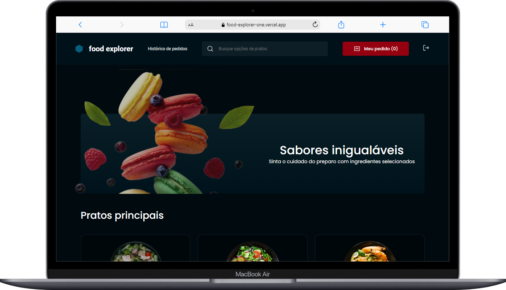

<div align="center">
 <h1>Food Explorer</h1>
  Click <a href = "https://food-explorer-one.vercel.app/">here</a> to see it live. <a href = "https://github.com/M0nicaVaz/food-explorer-api">Or go to backend repo.</a> 
  <br>
  <br>
  
  <div float="left">
    
    
  </div>
  
## Setup

**Clone the project and access the folder**

```bash
git clone https://github.com/M0nicaVaz/food-explorer.git && cd food-explorer
```

**Follow the steps below**
  
```bash
# Install the dependencies
yarn or npm install

# Run the web server
npm run dev
# or
yarn dev
```

Open [http://localhost:5173](http://localhost:5173) with your browser to see the result.

## Tech Stack
Made with 💜 by <a href="https://www.linkedin.com/in/monica-vaz/"> Monica Vaz </a> 
</div>
